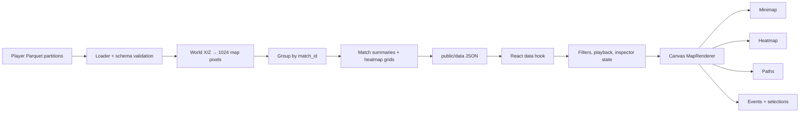

# ATLAS Architecture

ATLAS is a static analytics application: Python converts source telemetry into a browser contract, React owns user-interface state, and a Canvas renderer draws already-normalized map data.

## Data flow

Each `.nakama-0` file is one player journey partition. The pipeline decodes the byte event field, validates identifiers/maps/coordinates, transforms X/Z into minimap pixels, and groups by `match_id`. It writes an index plus one optimized JSON file per match, summary, and heatmap type. This avoids loading 1,243 Parquet files or embedding coordinate logic in the browser.

## Rendering and state

React stores filters, playback time/speed, layer visibility, player comparison, area selection, grid-highlight, and rail-width state. `MapRenderer` is deliberately unaware of fetches and product analytics: it receives immutable renderer-ready data and redraws at most once per animation frame. Its layers are minimap, heatmap, paths, events, and selections. The camera maintains map/screen transforms for pan, zoom, resize, hit testing, and the draggable area lens.

## Performance decisions

| Decision | Why |
| --- | --- |
| Canvas rather than SVG | Paths and markers update every playback frame; Canvas has lower retained-node overhead. |
| 1024 logical map space | Different native minimap resolutions share one stable coordinate/hit-test system. |
| One JSON per match | Initial index loads quickly; the browser fetches only the selected match. |
| Precomputed grids | Heatmap rendering is a fixed-size grid draw rather than a browser-side aggregation. |
| Cached temporal heatmaps | Playback reuses a match/type/time-bucket cache. |
| Renderer API updates | Layer/selection changes update only the necessary renderer state without reloading a match. |

## Trade-offs

Static JSON gives simple deployment and reproducible data, but a refresh is required after preprocessing. The renderer favours deterministic, pixel-space visualization over geospatial abstractions. Absolute timestamps and authoritative winners are intentionally omitted because the supplied schema cannot support them.
