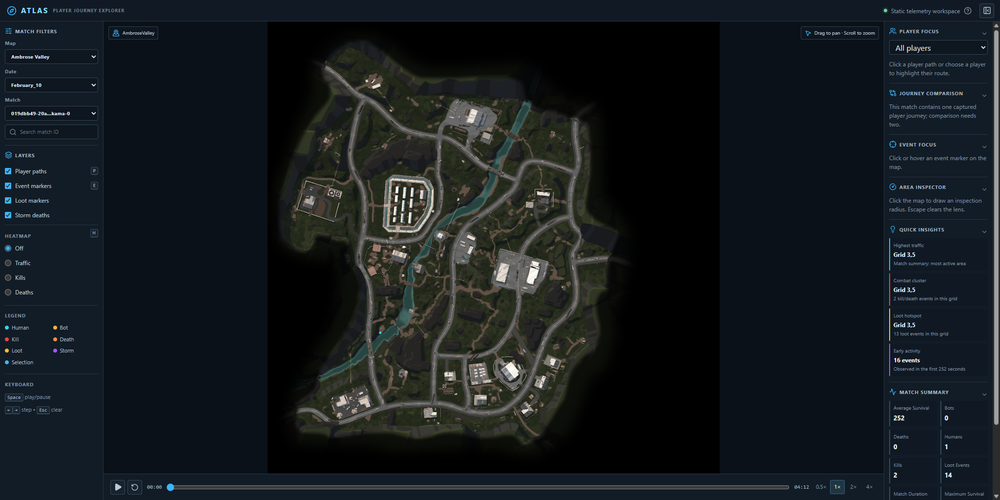
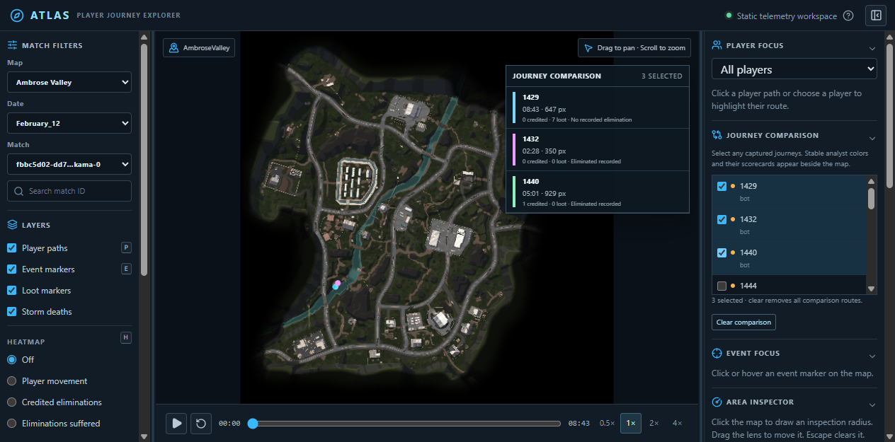

# ATLAS — Player Journey Explorer

ATLAS is a static, Canvas-based telemetry explorer for LILA BLACK. It turns one-player Parquet journey partitions into a Level Designer-facing map tool for replaying matches, inspecting movement, combat, loot, storm eliminations, and spatial density.

It was built for the LILA Product Engineer written test: the original brief asked for a deployed web tool that makes raw gameplay telemetry usable without requiring a data-science workflow.

## What it does

- Reconstructs matches by grouping every player partition on `match_id`.
- Maps validated world **X/Z** coordinates into a shared 1024×1024 minimap space during preprocessing.
- Differentiates humans, bots, player journeys, loot, credited eliminations, eliminations suffered, and storm eliminations.
- Filters by map, date, and match; replays telemetry with seek, keyboard controls, and 0.5×–4× playback.
- Provides cached temporal heatmaps for movement, credited eliminations, and eliminations suffered.
- Adds an area-inspection lens, grid-linked quick insights, multi-player route comparison, resizable analyst rails, and a match-outcome panel that avoids claiming unsupported winners.

See [ARCHITECTURE.md](ARCHITECTURE.md), [DATASET.md](DATASET.md), [DECISIONS.md](DECISIONS.md), [INSIGHTS.md](INSIGHTS.md), and [docs/PROJECT_HISTORY.md](docs/PROJECT_HISTORY.md).

## Screenshots

| Responsive workspace | Multi-player comparison |
| --- | --- |
|  |  |

## Architecture at a glance

```text
Parquet partitions + minimaps
        │ Python validation / coordinate mapping / match grouping
        ▼
public/data/{metadata,maps,matches,summaries,heatmaps}.json
        │ static fetch
        ▼
React controls ──► Canvas MapRenderer ──► layered minimap
```

The browser receives only validated minimap-pixel coordinates. It never reads Parquet or performs world-coordinate conversion.

## Stack

- React 19, TypeScript, Vite
- Canvas 2D renderer with separate minimap, heatmap, path, event, and selection layers
- Python with PyArrow for deterministic static preprocessing
- Static deployment target: Vercel, Netlify, or any host that serves the `dist/` folder

## Run locally

Prerequisites: Node.js 20+ and Python 3.11+ with PyArrow available.

```powershell
npm install
npm run dev
```

Open the local Vite URL. The app expects generated data under `public/data/`.

## Regenerate telemetry data

```powershell
python scripts/preprocess.py
```

The pipeline discovers all `player_data/February_*/*.nakama-0` Parquet files, validates source records and coordinate transforms, removes only an exact duplicate player-match partition, groups rows into matches, and writes deterministic JSON.

Current generated dataset:

- 1,243 source partitions; 89,104 source rows
- 796 reconstructed matches across AmbroseValley, GrandRift, and Lockdown
- 1,242 generated player records and 16,020 discrete events
- 796 match JSON files, 796 summaries, and 3,184 heatmap files

## Validate a release build

```powershell
npm run typecheck
npm run build
```

The preprocessing run also verifies its generated runtime contract before writing metadata. See [docs/FINAL_QA.md](docs/FINAL_QA.md) for the manual verification record.

## Deploy

1. Run the preprocessing command and commit `public/data/` if the hosting workflow requires data in the repository.
2. Import the repository into Vercel (or another static host).
3. Use `npm run build` as the build command and publish `dist/`.
4. Confirm `/data/metadata.json`, `/data/maps.json`, minimaps, match loading, playback, and heatmaps on the deployed URL.

No production URL is recorded in this workspace. Add it here before submission; the original assignment requires a shareable deployment.

## Known limits and deliberate trade-offs

- Telemetry timestamp epoch/unit conflicts with the source folder dates. ATLAS uses relative match ordering and durations, not wall-clock dates.
- The source has no authoritative winner, killer/victim relationship, weapons, items, or storm-zone IDs. “Last-survivor candidate” is deliberately qualified and only shown for defensible multi-player captures.
- Most generated match documents are one-player captures because source coverage is sparse. Comparison is available only where a selected match contains multiple captured players.
- A recurring-player leaderboard is feasible but is **not** shipped: it should be generated as a dedicated aggregate JSON artifact rather than fetched from all match files in the browser.

## Repository map

```text
scripts/               Python exploration and preprocessing pipeline
public/data/           Generated static runtime dataset
src/components/        React control surfaces
src/renderer/          Canvas renderer, camera, and visual layers
src/utils/             Runtime analytics derived from loaded match JSON
docs/                  Data audits, validation evidence, interview and QA notes
```

## License and acknowledgement

This is an assignment repository built from the supplied LILA BLACK telemetry and minimap assets. Treat the dataset and game assets as evaluation material; do not redistribute them outside the permitted review context.
